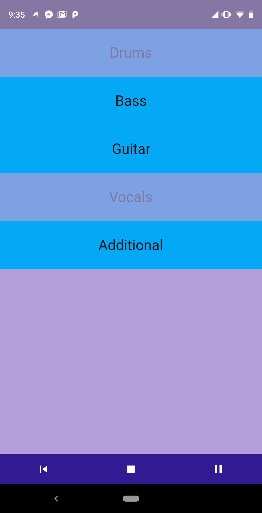

# stems

A stems player implementation for the Flutter platform.

## Stems what?

In music production, a _stem_ is a full-length mix of a single channel, track or instrument in your project.

A stems player allows you to listen to a song and mute each instrument individually while the song is playing. This is **not** intended to be a tool for music producers, but instead provides your audience with a fun experience to appreciate your song in an interactive way.

## What's in this demo?

This demo app includes the stems for the song "Kids" by MGMT, downloaded from [this source](https://remixpacks.ru/load/2/pop-1-0-9896/).

Play the song and tap on the instrument name to toggle muting.

## Try it out!

The fastest way of running this app is to download the .apk from the [releases section](https://github.com/javorosas/flutter_stems/releases) and install it in an Android device (or emulator).

## Compiling

1. Install [flutter](https://flutter.io/docs/get-started/install).
2. Clone this repo and `cd` to the folder.
3. Open an emulator or connect a physical device to your computer.
4. Run it in debug mode using `flutter run`.
